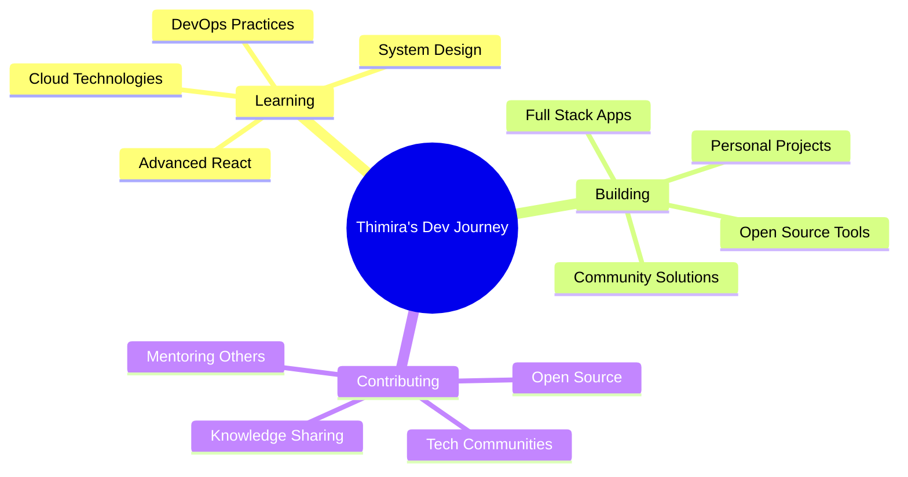

<div align="center">

<!-- Animated Header -->


<!-- Typing Animation -->
<p align="center">
  
</p>

<!-- Profile Views Counter -->
<p align="center"> 
  
  
</p>

</div>

---

## 🚀 About Me


```typescript
class Developer {
  name: string = "Thimira Niranjaya";
  location: string = "Sri Lanka 🇱🇰";
  education: string = "Information Systems Student";
  university: string = "Sabaragamuwa University of Sri Lanka";
  
  currentFocus: string[] = [
    "Full-Stack Development",
    "Information Systems",
    "Firebase Integration",
    "UI/UX Design",
    "System Analysis & Design"
  ];
  
  lifePhilosophy: string = "Code is poetry written in logic";
  
  getCurrentStatus(): string {
    return "Building innovative solutions through Information Systems 🎓";
  }
}

const thimira = new Developer();
```

<br clear="both">

---

## 🛠️ Tech Arsenal

### 💻 Languages & Frameworks
<div align="center">


</div>

### 🔥 Backend & Database
<div align="center">


</div>

### ⚙️ Tools & Platforms
<div align="center">


</div>

---

## 🎯 Featured Projects

<div align="center">

<table>
<tr>
<td width="50%">

### 🌐 Personal Portfolio
[](https://github.com/thimira20011/personal-portfolio)

**🔧 Tech Stack:** `JavaScript` `HTML` `CSS`
- ✨ Responsive & Interactive Design
- 🎨 Modern UI/UX Elements
- 📱 Mobile-First Approach

</td>
<td width="50%">

### 💰 Expense Tracker
[](https://github.com/thimira20011/expense-tracker)

**🔧 Tech Stack:** `Java` `Swing`
- 💳 Transaction Management
- 📊 Expense Analytics
- 🔐 Data Security

</td>
</tr>
<tr>
<td width="50%">

### ♻️ The Reuse Hub V2
[](https://github.com/thimira20011/the-reuse-hub-v2)

**🔧 Tech Stack:** `JavaScript` `Firebase` `HTML`
- 🌱 Sustainable Resource Sharing
- ⚡ Real-time Updates
- 👥 User Management System

</td>
<td width="50%">

### 🏪 The Reuse Hub
[](https://github.com/thimira20011/the-reuse-hub)

**🔧 Tech Stack:** `HTML` `CSS` `JavaScript`
- 🎯 MVP Implementation
- 📋 Item Catalog System
- 🔄 Borrowing Workflow

</td>
</tr>
</table>

</div>

---

## 📊 GitHub Analytics

<div align="center">
  


</div>

<div align="center">
  
[](https://git.io/streak-stats)

</div>

### 📈 Contribution Graph
<div align="center">


</div>

---

## 🏆 GitHub Trophies

<div align="center">

[](https://github.com/ryo-ma/github-profile-trophy)

</div>

---

## 🎨 Current Focus & Goals

<div align="center">



</div>

---

## 💻 Coding Activity

<div align="center">

<!--START_SECTION:waka-->
<!--END_SECTION:waka-->

</div>
