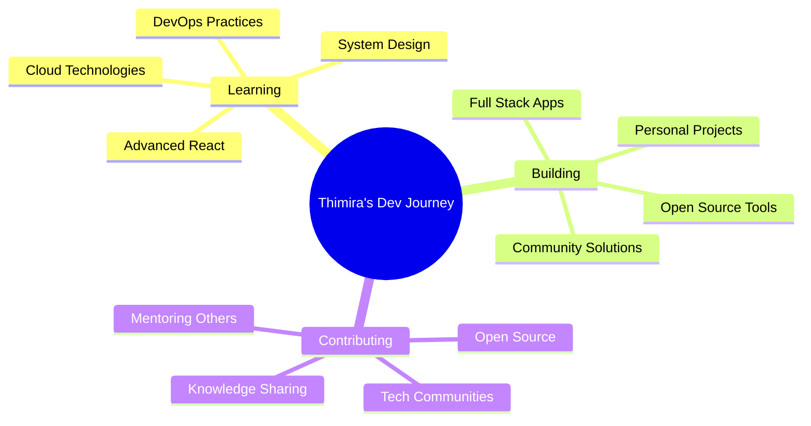
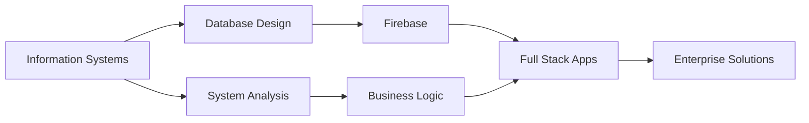

<div align="center">

<!-- Animated Header -->


<!-- Typing Animation -->
<p align="center">
  
</p>

<!-- Profile Views Counter -->
<p align="center"> 
  
  
</p>

</div>

---

## 🚀 About Me


```typescript
class Developer {
  name: string = "Thimira Niranjaya";
  location: string = "Sri Lanka 🇱🇰";
  education: string = "Information Systems Student";
  university: string = "Sabaragamuwa University of Sri Lanka";
  
  currentFocus: string[] = [
    "Full-Stack Development",
    "Information Systems",
    "Firebase Integration",
    "UI/UX Design",
    "System Analysis & Design"
  ];
  
  lifePhilosophy: string = "Code is poetry written in logic";
  
  getCurrentStatus(): string {
    return "Building innovative solutions through Information Systems ğŸ“";
  }
}

const thimira = new Developer();
```

<br clear="both">

---

## ğŸ› ï¸ Tech Arsenal

### 💻 Languages & Frameworks
<div align="center">


</div>

### 🔥 Backend & Database
<div align="center">


</div>

### âš™ï¸ Tools & Platforms
<div align="center">


</div>

---

## 🯠Featured Projects

<div align="center">

<table>
<tr>
<td width="50%">

### 🌠Personal Portfolio
[](https://github.com/thimira20011/personal-portfolio)

**🔧 Tech Stack:** `JavaScript` `HTML` `CSS`
- ✨ Responsive & Interactive Design
- 🨠Modern UI/UX Elements
- 📱 Mobile-First Approach

</td>
<td width="50%">

### 💰 Expense Tracker
[](https://github.com/thimira20011/expense-tracker)

**🔧 Tech Stack:** `Java` `Swing`
- 💳 Transaction Management
- 📊 Expense Analytics
- 🔠Data Security

</td>
</tr>
<tr>
<td width="50%">

### â™»ï¸ The Reuse Hub V2
[](https://github.com/thimira20011/the-reuse-hub-v2)

**🔧 Tech Stack:** `JavaScript` `Firebase` `HTML`
- 🌱 Sustainable Resource Sharing
- âš¡ Real-time Updates
- 👥 User Management System

</td>
<td width="50%">

### 🪠The Reuse Hub
[](https://github.com/thimira20011/the-reuse-hub)

**🔧 Tech Stack:** `HTML` `CSS` `JavaScript`
- 🯠MVP Implementation
- 📋 Item Catalog System
- 🔄 Borrowing Workflow

</td>
</tr>
</table>

</div>

---

## 📊 GitHub Analytics

<div align="center">
  


</div>

<div align="center">
  
[](https://git.io/streak-stats)

</div>

### 📈 Contribution Graph
<div align="center">


</div>

---

## 🆠GitHub Trophies

<div align="center">

[](https://github.com/ryo-ma/github-profile-trophy)

</div>

---

## 🨠Current Focus & Goals

<div align="center">


```mermaid
mindmap
  root((Thimira's Dev Journey))
    Learning
      Advanced React
      Cloud Technologies
      DevOps Practices
      System Design
    Building
      Full Stack Apps
      Open Source Tools
      Personal Projects
      Community Solutions
    Contributing
      Open Source
      Tech Communities
      Knowledge Sharing
      Mentoring Others
```

</div>

---

## 💻 Development Highlights

<div align="center">

### 📈 This Week's Focus
```text
🔥 Information Systems Projects    ████████████████████░   85%
💻 Web Development                 ████████████████░░░░░   75%
📚 Learning New Technologies       ████████████░░░░░░░░░   60%
🌠Firebase Integration           ███████████░░░░░░░░░░░   55%
```

### 🯠Current Learning Path

```mermaid
graph LR
    A[Information Systems] --> B[Database Design]
    A --> C[System Analysis]
    B --> D[Firebase]
    C --> E[Business Logic]
    D --> F[Full Stack Apps]
    E --> F
    F --> G[Enterprise Solutions]
```

</div>

---

## 🌟 What I'm Up To


- 📠Currently studying **Information Systems** at **Sabaragamuwa University of Sri Lanka**
- 🔭 Working on **Full-Stack Web Applications** and **System Analysis Projects**
- 🌱 Learning **Enterprise Systems, Database Management & Business Intelligence**
- 👯 Looking to collaborate on **Information System Solutions & Web Development**
- 🤠Open to **Internship & Job Opportunities in IT & Development**
- 💬 Ask me about **JavaScript, Java, Firebase, System Design, Web Development**
- ⚡ Fun fact: **I love turning complex business problems into elegant code solutions! 💡**

<br clear="both">

---

## 🤠Let's Connect & Collaborate

<div align="center">

[](https://www.linkedin.com/in/thimira-niranjaya-keerthiwansha?lipi=urn%3Ali%3Apage%3Ad_flagship3_profile_view_base_contact_details%3BqLh3nHH3T9Wh5gSYAdoT4w%3D%3D)
[](https://github.com/thimira20011)
[](mailto:tnirajaya2001@gmail.com)
[](https://x.com/TNiranjaya20011)
[](https://thimira20011.github.io/personal-portfolio/)
[](https://discord.gg/uNKFgMNr)
</div>

---

<div align="center">

### 💭 Random Dev Quote


</div>

---

<div align="center">

### 🯠Coding Stats & Activity


</div>

<div align="center">
  


</div>

<div align="center">


</div>

---

<div align="center">

**✨ "Code is like humor. When you have to explain it, it's bad." - Cory House ✨**


</div>
